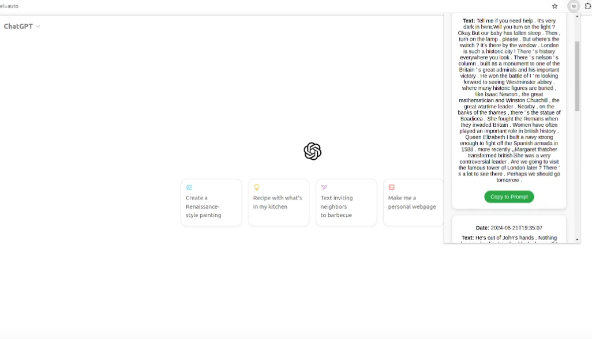

# GPT Journal

## **Inspiration**
The idea for **GPT Journal** was born out of frustration with large language models (LLMs) unable to remember past conversation. We wanted to use a database system to extend LLM's memory by storing conversation and bring relevant content to the current dialogue.  
This approach is particularly beneficial for daily interactions (like AI girlfriend!), where conversations can be difficult to label and track. By utilizing TiDB's vector search functionality, we can quickly access the most relevant past conversations, making the LLM more personalized and user-friendly. 
**check out our demo**: [https://youtu.be/oZ2QSClxp1U](https://youtu.be/oZ2QSClxp1U)
 
 

    

## **usage**
- the product now works as a chrome extension so make sure you have a chrome browser
- download the "chrome/" folder in our repository
- follow the [guidelines](https://developer.chrome.com/docs/extensions/get-started/tutorial/hello-world#load-unpacked) 
about "lock and unpacked extenstion" and install the extension by selecting the "chrome/" directory as the target folder in the Chrome Extensions page.

- Log in to chatgpt.com, type something in the prompt bar (e.g. "do you remember the last time we went to London?"), and when you're done, click the "Ask from Journal" button to retrieve dialogue.
  > **Note:** It normally takes 1 to 2 seconds to respond, please try again if it doesn't respond.

- click "store dialogue" to store all dialogues in the current window (please don't store too much data or repeat clicking, currently we are still unable to handle redundancy.)

## **ChatGPT Customization**

We uploaded the [DailyDialog dataset](https://paperswithcode.com/dataset/dailydialog) to help ChatGPT mimic conversations that have already taken place. To make the interactions feel more realistic, we suggest adding some customizations to ChatGPT.

### **Template We're Using**

**Custom Instructions:**
> I would refer to some previous conversations between us—please act as if those were our ongoing discussions.

**How would you like ChatGPT to respond?**
> Make it sound like a casual conversation between us—no third-person tone, like you're right in the conversation.

