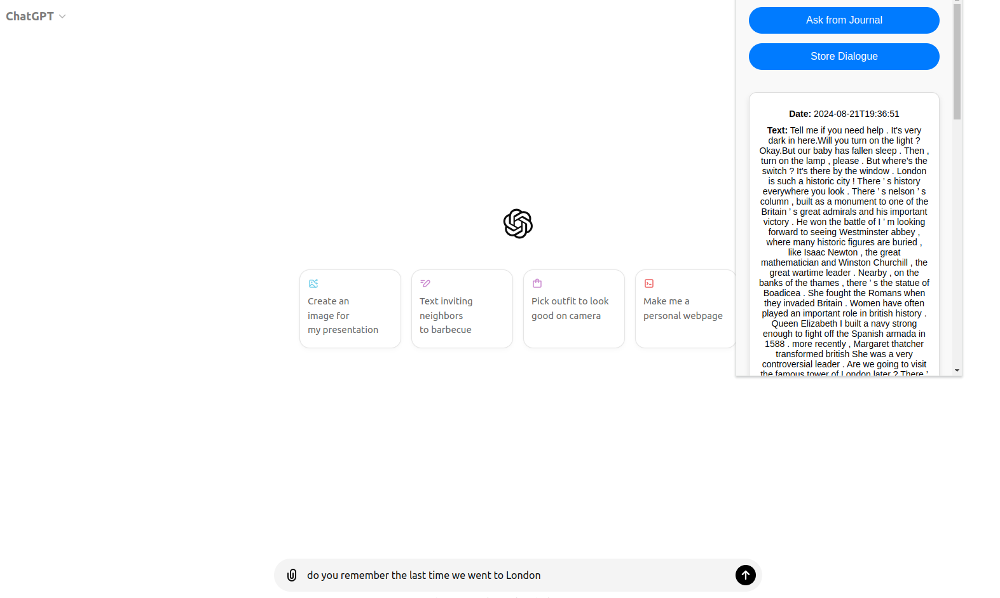

# GPT Journal

## **Inspiration**
The idea for **GPT Journal** was born out of frustration with large language models (LLMs) unable to remember past conversation. We wanted to use a database system to extend LLM's memory by storing conversation and bring relevant content to the current dialogue.  
This approach is particularly beneficial for daily interactions (like  AI girlfriend!), where conversations can be difficult to label and track. By utilizing TiDB's vector search functionality, we can quickly access the most relevant past conversations, making the LLM more personalized and user-friendly. 
**check out our demo**: [https://youtu.be/oZ2QSClxp1U](https://youtu.be/oZ2QSClxp1U)
 
 

    

## **usage**
- install the extension under the "chrome/" folder
- you need to type something in the prompt bar, once you finished, click the "Ask from Journal" button to retrieve dialogue
- click "store dialogue" to store all dialogues in the current window (please don't send too much data or repeat clicking, currently we are still unable to handle redundancy.)

